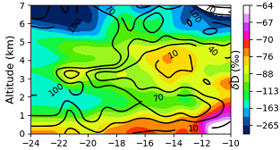

## WISPER ORACLES data products and processing code

**WISPER: Water Isotope System for Precipitation and Entrainment Research**

**ORACLES: ObseRvations of Aerosols above CLouds and their intEractionS** 

 


Processing code to create calibrated time series files and gridded level 3 products from the WISPER 
system during the NASA ORACLES field campaign. Data files and a brief explanation of the gridded products are 
available on [zenodo](https://doi.org/10.5281/zenodo.5748368). A detailed review of the 
instrument, measurements, data products, and calibration procedure can be found in 
[Henze et al., 2022](https://doi.org/10.5194/essd-14-1811-2022) which is also included in this 
directory (```essd-14-1811-2022.pdf```).

### Background

WISPER is designed to provide in-situ aircraft 
measurements of atmospheric water concentration and its heavy isotope ratios D/H and 
18O/16O for both total water and cloud water concentrations. It outputs time series 
data which can then be converted to gridded products or used directly.

ORACLES (ObseRvations of Aerosols above CLouds and their intEractionS) is a NASA earth 
science field experiment with three Intensive Observation Periods (IOPs) designed to study 
key processes that determine the climate impacts of African biomass burning aerosols. 
More information on the ORACLES field experiment can be found on the 
[NASA ESPO website](https://espo.nasa.gov/oracles/content/ORACLES) and in 
[Redemann et al., 2021](https://doi.org/10.5194/acp-21-1507-2021).

### Directory Guide

* Gridded products are created from the QC'd / calibrated time series .ict files located in 
```./apply_cal+QC/WISPER_calibrated_data/```. The processed time series .ict files can be reproduced 
by running ```python run_fullcal.py``` from within the folder ```./apply_cal+QC/```.

* The gridded products (netCDF) include mean latitude-altitude curtains for each sampling period 
(```./level3_products/wisper_oracles_curtains_*.nc```) and individual vertical profiles 
averaged to 50 m resolution for each sampling period (```./level3_products/wisper_oracles_verticalprofiles_*.nc```). 
They can be reproduced by running ```python curtains_latz.py``` and 
```python vertical_profiles.py```, respectively, from within the folder ```./level3_products/```.

* Parameter fits to the uncertainty function (see [Henze et al., 2022](https://doi.org/10.5194/essd-14-1811-2022), 
Section 5.4), are reproduced by running ```python uncertainty_estimation.py``` from within the folder ```./apply_cal+QC/``` 
and the results are stored in ```./apply_cal+QC/uncertainty_params.csv```.

### !! Additional Folders Required !!
This repo includes all necessary processing scripts. However, several folders containing the data files needed to reproduce the calibrated 
time series are not in this GitHub repo due to larger storage requirements, contact deanchenze@gmail.com to obtain them:
* ```./apply_cal+QC/WISPER_raw_data/```
* ```./apply_cal+QC/outlier_time_intervals/```
* ```./apply_cal+QC/P3_merge_data/```
